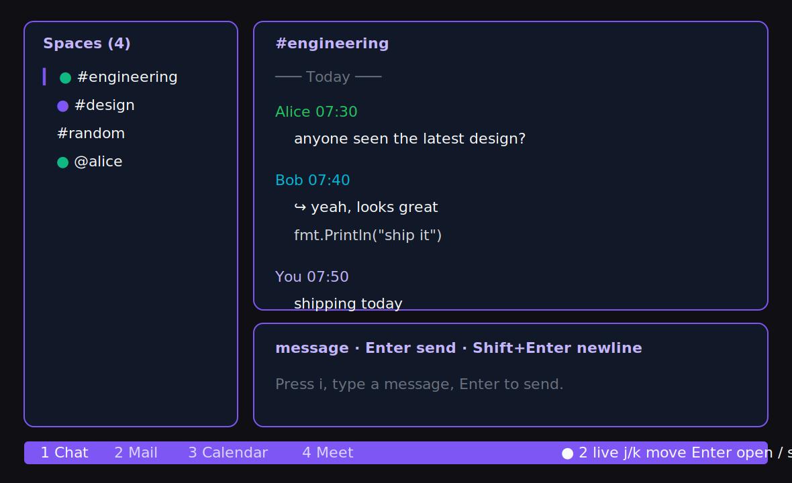

# gws TUI

Standalone terminal UI for Google Workspace, exposed as:

```sh
gws tui
```



The TUI is built with Bubble Tea, Bubbles, and Lip Gloss. It keeps the existing
Lua Neovim plugin contract intact: non-`tui` commands are delegated to an
installed upstream `gws` binary.

## Project Status

`gws-tui` is preparing for its first public release. Expect a local-first CLI
workflow, an upstream `gws` dependency for real Workspace auth/API access, and
optional daemon mode, but review
`docs/RELEASE_CHECKLIST.md` before cutting a tag or announcing a release.

Supported release targets for now are macOS and Linux. Windows is not part of
the first release because daemon lifecycle management currently depends on
Unix-style process and socket behavior.

## Install

### Quick install

After cloning the repository, run the installer. It installs the upstream
Google Workspace CLI, builds and installs the TUI, and walks you through a
bring-your-own Google Cloud project for authentication:

```sh
bash scripts/install.sh
```

Pass `--no-auth` to skip the Google Cloud setup step. To undo everything, run
`bash scripts/uninstall.sh` (add `--purge` to also delete cached config,
state, and image data).

### Manual install

Prerequisite: install and authenticate the upstream Google Workspace CLI as
`gws` first, then verify it works:

```sh
gws auth status
```

Install the TUI binary:

```sh
go install github.com/fabhiansan/gws-tui/cmd/gws@latest
gws tui
```

If the TUI binary shadows the upstream CLI on `PATH`, delegation should still
find the next `gws` executable. If your upstream CLI lives somewhere custom, set:

```sh
export GWS_TUI_UPSTREAM=/path/to/upstream/gws
```

For release archives, download the archive for your OS/architecture, then:

```sh
tar -xzf gws-darwin-arm64.tar.gz
mkdir -p ~/.local/bin
install -m 0755 gws ~/.local/bin/gws
gws tui
```

For local development:

```sh
go build -o ./bin/gws ./cmd/gws
./bin/gws tui
```

## Commands

```sh
gws tui
gws tui --feature chat
gws tui --feature mail
gws tui --feature calendar
gws tui --feature meet
gws tui --auth
gws tui --daemon
gws tui --no-daemon
gws tui --no-icons
gws tui --no-color
gws tui --no-images
gws tui --no-vim
gws tui --version
gws daemon start
gws daemon start --detach
gws daemon status
gws daemon stop
gws daemon restart
gws daemon logs
```

The TUI requires the upstream Google Workspace CLI for live data. If it cannot
find an upstream `gws`, it exits with a setup error instead of showing dummy
data. Run `gws tui --help` or `gws daemon --help` for the live flag list.

## Keys

Press `?` in the app for the complete keybinding reference. The list below
covers the high-frequency actions.

Global:

- `?`: toggle help
- `Ctrl+1`/`Ctrl+2`/`Ctrl+3`/`Ctrl+4`: switch Chat, Mail, Calendar, Meet
- `Tab` / `Shift+Tab`: cycle features
- `1`/`H`/`Ctrl+H`: focus list pane
- `2`/`L`/`Ctrl+L`: focus detail pane
- `3`/`i`: focus action pane
- `j`/`k`: move
- `Enter`/`o`: open selected item
- `/`: search
- `m`: load more
- `r`: refresh current feature
- `Ctrl+R`: reload config
- `Esc`: return focus to the list pane
- `q`: quit

Detail pane:

- `h`/`j`/`k`/`l`, `w`/`b`/`e`, `0`/`$`: move the text cursor
- `v`/`V`: select text by character or line
- `y`/`yy`: yank selection or current line
- `Enter`/`o`: open the URL under the cursor, or the only URL on the line;
  attachment lines still open image preview/download actions

Chat:

- `Enter`: send
- `Shift+Enter`: newline
- `s`: toggle live subscription marker
- `R`: refresh all workspace data

Mail:

- `H`: focus the folder sidebar (Inbox, Starred, Important, …)
- `j`/`k` then `Enter`: move the folder cursor and open that folder
- `c`: compose
- `R`: reply
- `f`: forward
- `e`: archive
- `#`: trash
- `s`: star/unstar

Calendar:

- `c`: full event composer
- `i`: quick add from action pane
- `h`/`l`: move day in month view
- `j`/`k`: move week in month view
- `J`/`K`: choose activity within the focused day
- `y`/`n`/`M`: RSVP yes/no/maybe
- `d`: delete
- `r`: refresh the current calendar view
- `t`: jump to today
- `[`/`]`: previous/next week marker

Meet:

- `n`: create new space
- `J`: join in browser
- `C`: copy link
- `E`: end active conference

Tasks:

- `Space`: complete/uncomplete selected task
- `d`: delete selected task
- `[`/`]`: previous/next task list
- `m`: load more tasks

## Config

Config is read from the first path that exists:

```text
$GOOGLE_WORKSPACE_CLI_CONFIG_DIR/tui.toml
$XDG_CONFIG_HOME/gws/tui.toml
~/.config/gws/tui.toml
```

The example below shows the default keys and default path layout:

```toml
initial_feature = "chat"
theme = "gmail"
no_icons = false
no_color = false
notify_desktop = true
notify_sound = true
notify_sound_file = "/System/Library/Sounds/Glass.aiff"
inline_images = true
vim_mode = true
daemon = false
daemon_socket = "$XDG_RUNTIME_DIR/gws/daemon.sock"
daemon_autospawn = true
daemon_log = "~/.cache/gws/daemon.log"
daemon_pid_file = "$XDG_RUNTIME_DIR/gws/daemon.pid"
chat_events = true
state_path = "~/.config/gws/tui-state.json"
cache_path = "~/.cache/gws/tui-cache.json"
image_cache_dir = "~/.cache/gws/images"
draft_dir = "~/.cache/gws/drafts"
log_path = "~/.cache/gws/tui.log"
```

By default, state is written under the resolved config dir as
`tui-state.json`. Workspace list/detail data is cached under the resolved cache
dir as `tui-cache.json` so the TUI can restart without refetching every pane;
press `r` to refresh from Google Workspace. Draft compose snapshots are
autosaved every five seconds under the resolved `draft_dir`.

When running in Kitty, image attachments and direct image URLs in chat/mail can
render inline after being cached under `image_cache_dir`; use `--no-images` or
`inline_images = false` to fall back to text-only attachment links.
Authenticated Google Chat attachments are downloaded through the upstream
`gws chat media download` command so existing Workspace credentials are used
instead of browser cookies.

See `docs/PRIVACY.md` for local cache, state, draft, image, log, and cleanup
details.

## Daemon Mode

Daemon mode is optional. `gws tui` remains standalone by default. Use:

```sh
gws daemon start --detach
gws tui --daemon
gws daemon status
gws daemon logs
gws daemon stop
```

When `daemon = true` or `--daemon` is set, the TUI attaches to a per-user Unix
socket and becomes a thin client. Workspace calls, cache writes, chat delivery,
desktop notifications, attachment downloads, and draft autosave are owned by
the daemon. UI state such as selection, scroll, focus, search, and vim mode
stays local to each TUI session.

### Real-time chat

With `chat_events = true` (the default) the daemon checks once, on startup,
whether it can receive chat messages in real time through the Google Workspace
Events API. When your Google Cloud project has the **Pub/Sub** and **Workspace
Events** APIs enabled, a single `gws events +subscribe` stream covers every
space at once and the daemon renews the subscription automatically. Otherwise
it falls back to polling each space every 5 seconds. Either way chat works —
`gws daemon logs | grep 'chat'` shows which mode is active.

Set `chat_events = false` to force polling. The project is auto-detected from
`gws auth status`; override it with `chat_events_project` /
`chat_events_subscription` (or the `GWS_EVENTS_PROJECT` /
`GWS_EVENTS_SUBSCRIPTION` environment variables).

If `$XDG_RUNTIME_DIR` is unavailable, the socket and PID file fall back under
`~/.cache/gws`. `daemon_autospawn = true` makes `gws tui --daemon` start the
daemon automatically when the socket is missing. `gws daemon start` keeps the
server in the foreground for a service manager, while `gws daemon start
--detach` backgrounds it and returns immediately. `gws daemon logs` prints the
most recent daemon log lines from `daemon_log`. Example service files live in
`docs/launchd/` and `docs/systemd/`; edit the binary path before installing
them.

## Compatibility

The Lua plugin is not modified by this repository. Non-TUI commands are
delegated to the upstream CLI, and tests cover the command parser plus the API
shapes used by the plugin:

- `gws auth status`
- `gws chat spaces list`
- `gws chat spaces messages list`
- `gws gmail users messages list`
- `gws calendar events list`
- `gws meet spaces list`

Run:

```sh
go test ./...
go vet ./...
go build ./...
```

Manual smoke remains required before a release:

1. Build the binary.
2. Put it on `PATH` ahead of the old `gws`, or set the plugin to use it.
3. Set `GWS_TUI_UPSTREAM` if the upstream CLI is not discoverable as another
   `gws` on `PATH`.
4. Run `:GwsOpen` in Neovim and verify existing plugin flows still work.
5. Run `gws tui` and verify Chat, Mail, Calendar, and Meet screens open.
6. Run `gws daemon start --detach && gws tui --daemon`, then open a second TUI
   and verify both clients receive live chat events.

## Contributing and Security

- Contribution workflow: `CONTRIBUTING.md`
- Security reporting: `SECURITY.md`
- Privacy and local data: `docs/PRIVACY.md`
- Release checklist: `docs/RELEASE_CHECKLIST.md`
- Reddit launch notes: `docs/REDDIT_LAUNCH.md`

## License

MIT. See `LICENSE`.
